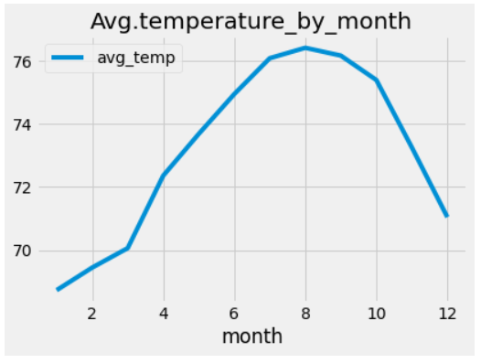
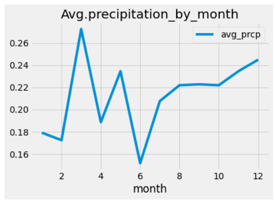

# surfs_up
## Purpose
- The purpose of the project is to analyze the weather trend in Oahu,Hawaii so as to help the client determine if the surf and ice cream shop business is sustainable year-round.

## Results
- More data collection in June than in December, data is well distributed by mean almost equal to median
  From the dataset, there're 1700 collections in June, while 1571 data collection in December. The median of June temperatrue is 75, comparing with the mean 74.9. The median of December temperature is 71, while mean is 71.04. So the average temperature can well represent the overall trend in both months.

- The average temperature of June and December doesn't change significantly
  Comparing the mean of December and June temperature, we can see the temperature of June and December doesn't differ too much from each other, by June's average temperature at 74.94 and December's average at 71.03.

- The temperature range in December is wider than that in June
 
While the mean temperature of June and December only varies by 3.91, the minimum temperature in December is 56, way lower than that in June; Meanwhile, max temperature doesn't differ too much between June and December,from which we can tell the temperature difference in December is more significant than that in June.

## Summary
- From analyzing temperature of June and December, we can see:
  Even though the minimum temperature in December is significantly lower than that in June, the temperature in Oahu, Hawaii doesnt' differ too much between June and December, with the average temperature only varying by 3.91. 

- In order to determine year-round temperature trend, we will need to have an understanding of the temperature trend by month, and see if that's stable enough to support the business. This is the query I would suggest:
 #Trend of temperature by month
 results = session.query(extract('month', Measurement.date),func.min(Measurement.tobs), func.max(Measurement.tobs), func.avg(Measurement.tobs)).\
 group_by(extract('month', Measurement.date)).order_by(extract('month', Measurement.date)).all()
 df=pd.DataFrame(results, columns=["month","min_temp","max_temp","avg_temp"])
 df.plot('month',"avg_temp")
 plt.title('Avg.precipitation_by_month')
  
From the "average temperature by month" chart below, we can see the year-round average temperature is between 68-76, which doesn't vary too much throughout the year. This is a positive aspect to support the surf and ice-cream shop business year-round.

- In addition to the temperature, we can also take a look at the precipitation throughout the year, so as to the determine the other weather aspects to business state. From the module, we've learned that the most active station out of all 9 stations is 'USC00519281'.I would suggest running following query to get the precipitation trend based on the most active station's data:
 # Trend of precipitation by month from most active station USC00519281
 results = session.query(extract('month', Measurement.date),func.count(Measurement.prcp), func.avg(Measurement.prcp)).\
 filter(Measurement.station == 'USC00519281').\
 group_by(extract('month', Measurement.date)).order_by(extract('month', Measurement.date)).all()
 df=pd.DataFrame(results, columns=["month","frequency_prcp","avg_prcp"])
 df.plot("month","avg_prcp")
 plt.title('Avg.temperature_by_month')
  
From the "average precipitation by month" chart below, we can see the precipitation varies by months. We may expect more rain in March and Decemeber, and less rain from April to June, which may also affect the revenue between months.

